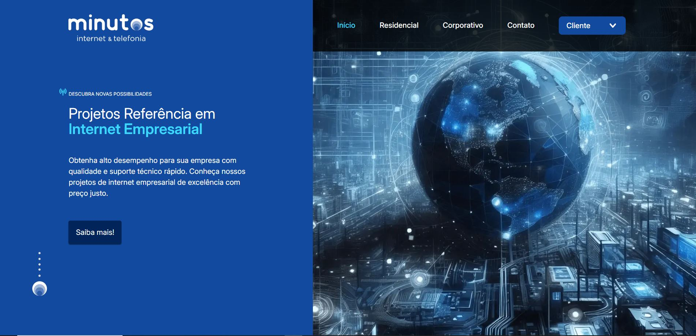

<h1 align="center">

🖥 Minutos Telecom - Site Vitrine

</h1>

Depuis 2007, **Minutos Telecom** propose des solutions en télécommunications et technologies de l’information, adaptées aux besoins d’entreprises de toutes tailles ainsi qu’aux particuliers. Basée à Campinas (São Paulo, Brésil), l’entreprise compte plus de 500 clients, parmi lesquels **Embraer** et **Nacional INN**.

## 🔍 Contexte

Ami de longue date du fondateur de Minutos Telecom, j’ai identifié une opportunité stratégique d’amélioration de sa présence en ligne. Après une évaluation du site existant, j’ai proposé une refonte technique avec des objectifs clairs : améliorer l’image numérique de l’entreprise, renforcer sa crédibilité et moderniser sa communication.

Ce projet m’a permis d’approfondir mes compétences front-end tout en livrant une solution concrète à un client réel.

## 📸 Démonstration du projet

🔗 **Lien vers le site déployé** : [minutostelecom.com.br](https://www.minutostelecom.com.br/)  

<h2 align="center">

</h2>

## 🚀 Détails du projet

- 🔧 **Technos utilisées** : HTML, CSS, JavaScript (vanilla)
- 💻 **Design** : Maquette réalisée sur Figma
- 📱 **Responsive** : Oui, adapté à tous les formats d’écran
- ✅ **Statut** : Site validé et mis en ligne par le client
- 🧩 **Fonctionnalités** :
  - Navigation fluide entre sections
  - Formulaire de contact fonctionnel
  - Code structuré, clair et maintenable

## 🚧 Défis techniques

Parmi les défis notables :
- Garantir un rendu responsive fiable sans framework
- Optimiser la performance et l’accessibilité dès la version initiale
- Structurer le code pour faciliter la future transition vers un environnement React

## 🧪 Tests et qualité

- **Accessibilité** : Audit réalisé avec Lighthouse (score > 90%)
- **Performance** : Chargement rapide et code allégé
- **Compatibilité** : Fonctionne sur les principaux navigateurs (Chrome, Firefox, Safari)
- **Validation** : Code conforme aux standards HTML/CSS (W3C Validator)

## 🔄 Évolution prévue

Le site sera **reconstruit avec React et Tailwind CSS** afin d’optimiser la maintenabilité, la scalabilité et d'intégrer de nouvelles fonctionnalités dynamiques.

## 🖥 Projet back-end

Le développement du système d’administration (back-office) est disponible ici :  
🔗 [Dépôt GitHub du projet back-end](https://github.com/pmgoudet/minutos-telecom-_php)

## 🔗 Autres liens

- 🌐 [Mon portfolio complet](https://pedrogoudet.vercel.app/)
- 🧑‍💼 [Mon profil LinkedIn](https://www.linkedin.com/in/pmgoudet)
